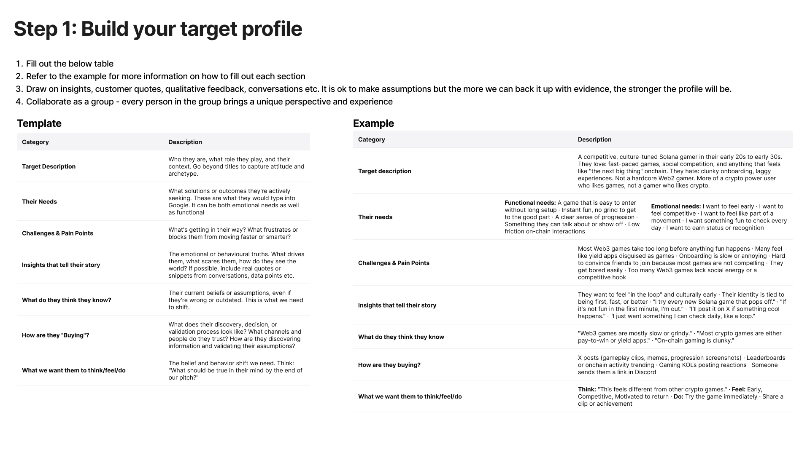
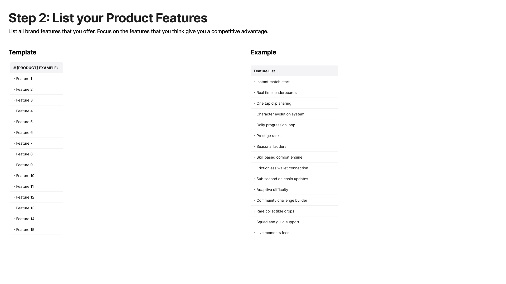
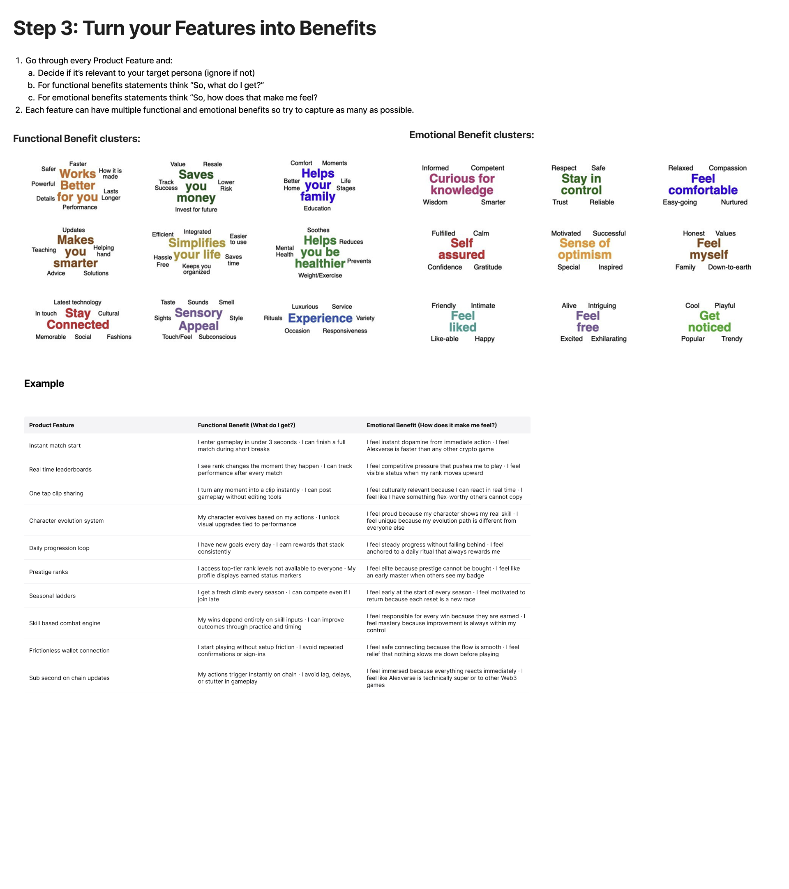
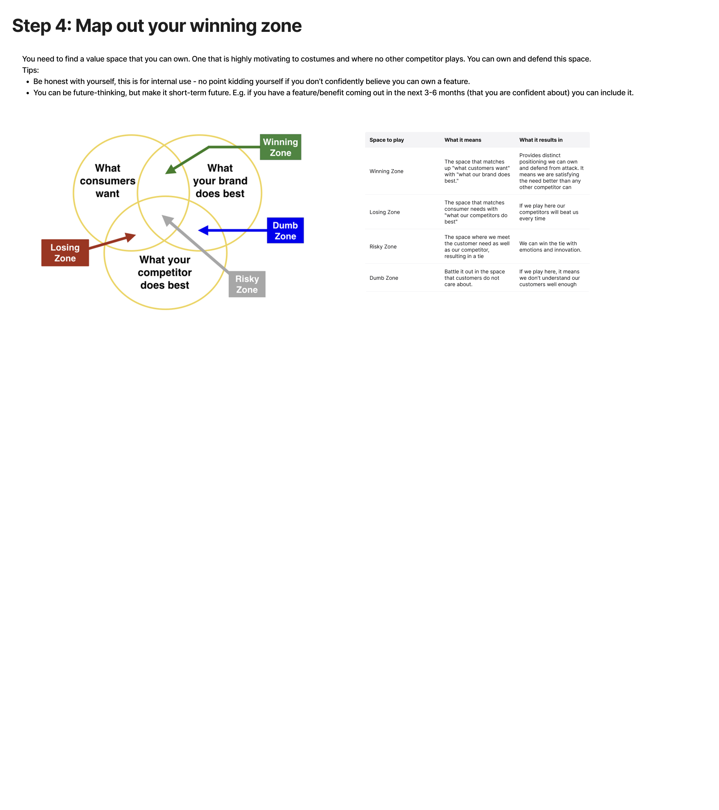
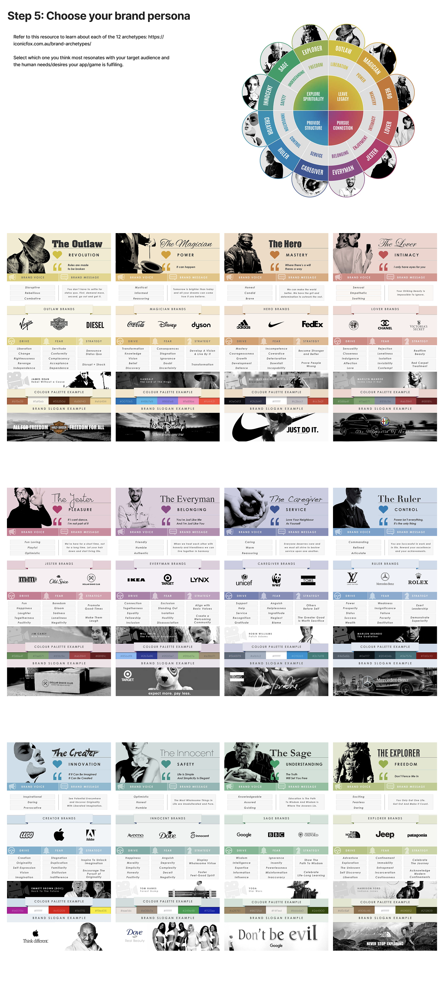

# Brand

## Prompt

1. Target Profile

    > [!TIP]
    > We're going to creat clawdbot as a service, ignoring the actual technology, come up with a brand profile using this attached image
    >
    > - https://clawdhub.com
    > - https://clawdhub.com/skills
    > - https://x.com/steipete

    ```
    We're going to create a <product>, build the brand target profile following the attached image.

    - consumer vs b2b
    - add references to websites
    - "this for that"
    - any high level ideas your beleive
    ```

    

2. Product Features

    ```
    Okay lets talk features, lets list all of teh potential project features that would be amazing for a consumer
    ```

    


3. Features to Benefits

    ```
    Next, turn our features into benefits following this process in the photo
    ```

    


4. Winning Zone

    ```
    Our next step is to map our our winning zone, how will our AI service outperform everyone else in the winning zone?
    ```

    

5. Brand Persona

    ```
    Now based on this, lets chose a primary and secondary brand persona
    ```

    

6. Brand Guidelines

    ```
    Translate this into brand guidelines, tone of voice examples, and create visual direction
    ```

7. Webiste

    ```
    Research Aura.build and some of it's most popular templates. Create a prompt that I can put into v0.app that will allow me to create an amazingly rich visually appealing landing page.


    - How to Use This
    - Full Prompt (Copy This First)
    - Section-by-Section Refinement Prompts
    - Style Refinement Prompts
    - Alternative Hero Prompts
    - Component Prompts for Remixing
    - Final Checklist Prompt
    - Notes for Best Results
    ```

8. Video

    ```
    Look at the remotion accounts and this sample project and come up with a series of prompts to create an amazing marketing video. I will be prompting these via claude code.
    * https://x.com/Remotion/status/2013626968386765291
    * https://gist.github.com/JonnyBurger/5b801182176f1b76447901fbeb5a84ac
    * https://www.remotion.dev

    We need the prompts for a complete marking video
    ```